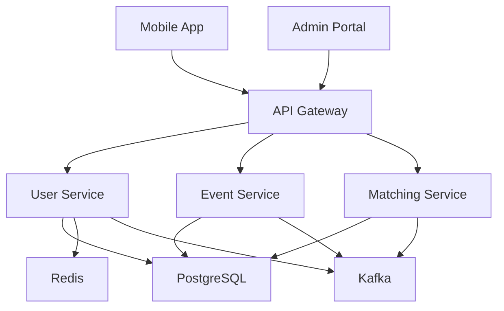

# Meetinity API Gateway - Complete Documentation

The **Meetinity API Gateway** is the central entry point for all client requests in the Meetinity professional networking platform. It handles request routing, authentication, rate limiting, and load balancing across all microservices.

## Architecture Overview

Meetinity uses a **microservices architecture** with the following components:

### Core Services
- **API Gateway** (this service) - Request routing and authentication
- **User Service** - OAuth authentication and profile management
- **Event Service** - Event creation, discovery, and registration
- **Matching Service** - Professional matching algorithms
- **Mobile App** - React-based mobile application
- **Admin Portal** - React-based administration interface

### Infrastructure Services
- **PostgreSQL 15** - Primary database for all services
- **Apache Kafka 3.5** - Event streaming and inter-service communication
- **Redis** - Caching and session storage
- **Zookeeper** - Kafka coordination

## Technology Stack

- **Framework**: Flask 3.0
- **Language**: Python 3.11
- **WSGI Server**: Gunicorn 21.2.0
- **Authentication**: JWT tokens
- **Rate Limiting**: Flask-Limiter
- **CORS**: Flask-CORS

## Quick Start

### Prerequisites
- Python 3.11+
- PostgreSQL 15
- Redis
- Apache Kafka 3.5

### Installation

```bash
# Clone the repository
git clone https://github.com/decarvalhoe/meetinity-api-gateway.git
cd meetinity-api-gateway

# Create virtual environment
python3.11 -m venv venv
source venv/bin/activate

# Install dependencies
pip install -r requirements.txt
```

### Environment Variables

Create a `.env` file with the following variables:

```env
# Service Configuration
APP_PORT=8080
LOG_LEVEL=INFO

# User Service Configuration
USER_SERVICE_URL=http://localhost:8081
USER_SERVICE_NAME=user-service
USER_SERVICE_STATIC_INSTANCES=localhost:8081

# Service Discovery
SERVICE_DISCOVERY_BACKEND=static
SERVICE_DISCOVERY_REFRESH_INTERVAL=30
LOAD_BALANCER_STRATEGY=round_robin

# Authentication
JWT_SECRET=your-jwt-secret-key

# CORS Configuration
CORS_ORIGINS=http://localhost:3000,http://localhost:3001

# Rate Limiting
RATE_LIMIT_AUTH=10/minute

# Proxy Configuration
PROXY_TIMEOUT_CONNECT=2
PROXY_TIMEOUT_READ=10

# Resilience Configuration
RESILIENCE_MAX_RETRIES=2
RESILIENCE_BACKOFF_FACTOR=0.5
RESILIENCE_MAX_BACKOFF=5
CIRCUIT_BREAKER_FAILURE_THRESHOLD=3
CIRCUIT_BREAKER_RESET_TIMEOUT=30
```

### Running the Service

#### Development Mode
```bash
# Start the development server
python src/app.py
```

#### Production Mode
```bash
# Start with Gunicorn
gunicorn --bind 0.0.0.0:8080 --workers 4 --timeout 120 "src.app:create_app()"
```

### Docker Deployment

```bash
# Build the Docker image
docker build -t meetinity-api-gateway .

# Run the container
docker run -p 8080:8080 --env-file .env meetinity-api-gateway
```

## Service Integration

### Connecting to Other Services

#### User Service Integration
The API Gateway routes authentication and user management requests to the User Service:

```python
# User Service endpoints routed through API Gateway
POST /api/auth/login          -> User Service
POST /api/auth/register       -> User Service
GET  /api/users/profile       -> User Service
PUT  /api/users/profile       -> User Service
```

#### Event Service Integration
Event-related requests are routed to the Event Service:

```python
# Event Service endpoints
GET  /api/events              -> Event Service
POST /api/events              -> Event Service
GET  /api/events/{id}         -> Event Service
POST /api/events/{id}/register -> Event Service
```

#### Matching Service Integration
Professional matching requests are handled by the Matching Service:

```python
# Matching Service endpoints
GET  /api/matches             -> Matching Service
POST /api/matches/swipe       -> Matching Service
GET  /api/matches/preferences -> Matching Service
```

### Service Discovery Configuration

The API Gateway supports multiple service discovery backends:

#### Static Configuration (Default)
```env
SERVICE_DISCOVERY_BACKEND=static
USER_SERVICE_STATIC_INSTANCES=localhost:8081,localhost:8082
```

#### Load Balancing Strategies
- `round_robin` - Distribute requests evenly
- `random` - Random selection
- `least_connections` - Route to least busy instance

## Complete Infrastructure Setup

### All Service Repositories
```bash
# Clone all repositories
git clone https://github.com/decarvalhoe/meetinity.git
git clone https://github.com/decarvalhoe/meetinity-api-gateway.git
git clone https://github.com/decarvalhoe/meetinity-user-service.git
git clone https://github.com/decarvalhoe/meetinity-event-service.git
git clone https://github.com/decarvalhoe/meetinity-matching-service.git
git clone https://github.com/decarvalhoe/meetinity-mobile-app.git
git clone https://github.com/decarvalhoe/meetinity-admin-portal.git
```

### Service Ports
- **API Gateway**: 8080
- **User Service**: 8081
- **Matching Service**: 8082
- **Event Service**: 8083
- **Mobile App**: 3000
- **Admin Portal**: 3001
- **PostgreSQL**: 5432
- **Kafka**: 9092
- **Kafka UI**: 8085
- **Zookeeper**: 2181

### Database Schemas

#### Users Table (User Service)
```sql
CREATE TABLE users (
    id UUID PRIMARY KEY DEFAULT gen_random_uuid(),
    email VARCHAR(255) UNIQUE NOT NULL,
    name VARCHAR(255) NOT NULL,
    oauth_provider VARCHAR(50),
    oauth_id VARCHAR(255),
    profile_picture_url TEXT,
    bio TEXT,
    location VARCHAR(255),
    industry VARCHAR(100),
    job_title VARCHAR(255),
    company VARCHAR(255),
    linkedin_url VARCHAR(500),
    created_at TIMESTAMP DEFAULT NOW(),
    updated_at TIMESTAMP DEFAULT NOW()
);

CREATE TABLE user_preferences (
    id UUID PRIMARY KEY DEFAULT gen_random_uuid(),
    user_id UUID REFERENCES users(id) ON DELETE CASCADE,
    age_min INTEGER,
    age_max INTEGER,
    location_radius INTEGER,
    industries TEXT[],
    created_at TIMESTAMP DEFAULT NOW(),
    updated_at TIMESTAMP DEFAULT NOW()
);
```

#### Events Table (Event Service)
```sql
CREATE TABLE events (
    id UUID PRIMARY KEY DEFAULT gen_random_uuid(),
    title VARCHAR(255) NOT NULL,
    description TEXT,
    location VARCHAR(255),
    latitude DECIMAL(10, 8),
    longitude DECIMAL(11, 8),
    start_date TIMESTAMP NOT NULL,
    end_date TIMESTAMP,
    max_attendees INTEGER,
    current_attendees INTEGER DEFAULT 0,
    category VARCHAR(100),
    tags TEXT[],
    created_by UUID REFERENCES users(id),
    created_at TIMESTAMP DEFAULT NOW(),
    updated_at TIMESTAMP DEFAULT NOW()
);

CREATE TABLE event_registrations (
    id UUID PRIMARY KEY DEFAULT gen_random_uuid(),
    event_id UUID REFERENCES events(id) ON DELETE CASCADE,
    user_id UUID REFERENCES users(id) ON DELETE CASCADE,
    status VARCHAR(20) DEFAULT 'registered',
    registered_at TIMESTAMP DEFAULT NOW(),
    UNIQUE(event_id, user_id)
);
```

#### Matches Table (Matching Service)
```sql
CREATE TABLE user_matches (
    id UUID PRIMARY KEY DEFAULT gen_random_uuid(),
    user1_id UUID REFERENCES users(id) ON DELETE CASCADE,
    user2_id UUID REFERENCES users(id) ON DELETE CASCADE,
    compatibility_score DECIMAL(3, 2),
    status VARCHAR(20) DEFAULT 'pending',
    matched_at TIMESTAMP DEFAULT NOW(),
    UNIQUE(user1_id, user2_id)
);

CREATE TABLE swipe_history (
    id UUID PRIMARY KEY DEFAULT gen_random_uuid(),
    swiper_id UUID REFERENCES users(id) ON DELETE CASCADE,
    swiped_id UUID REFERENCES users(id) ON DELETE CASCADE,
    action VARCHAR(10) NOT NULL, -- 'like' or 'pass'
    swiped_at TIMESTAMP DEFAULT NOW(),
    UNIQUE(swiper_id, swiped_id)
);
```

## Inter-Service Communication

### Kafka Topics
```bash
# User events
user.created
user.updated
user.deleted

# Event events
event.created
event.updated
event.registration.created

# Matching events
match.created
match.updated
swipe.performed
```

### Service Dependencies


## API Documentation

### Authentication Endpoints
```http
POST /api/auth/login
POST /api/auth/register
POST /api/auth/refresh
POST /api/auth/logout
GET  /api/auth/oauth/google
GET  /api/auth/oauth/linkedin
```

### User Management Endpoints
```http
GET    /api/users/profile
PUT    /api/users/profile
DELETE /api/users/profile
GET    /api/users/preferences
PUT    /api/users/preferences
POST   /api/users/upload-avatar
```

### Event Management Endpoints
```http
GET    /api/events
POST   /api/events
GET    /api/events/{id}
PUT    /api/events/{id}
DELETE /api/events/{id}
POST   /api/events/{id}/register
DELETE /api/events/{id}/unregister
GET    /api/events/{id}/attendees
```

### Matching Endpoints
```http
GET    /api/matches
GET    /api/matches/potential
POST   /api/matches/swipe
GET    /api/matches/history
PUT    /api/matches/{id}/status
```

## Security Configuration

### JWT Token Structure
```json
{
  "header": {
    "alg": "HS256",
    "typ": "JWT"
  },
  "payload": {
    "user_id": "uuid",
    "email": "user@example.com",
    "role": "user",
    "exp": 1640995200,
    "iat": 1640908800
  }
}
```

### CORS Configuration
```python
CORS_ORIGINS = [
    "http://localhost:3000",  # Mobile App
    "http://localhost:3001",  # Admin Portal
    "https://meetinity.com",  # Production domain
    "https://admin.meetinity.com"  # Admin production
]
```

### Rate Limiting Rules
```python
RATE_LIMITS = {
    "/api/auth/*": "10/minute",
    "/api/users/*": "100/minute",
    "/api/events/*": "50/minute",
    "/api/matches/*": "30/minute",
    "/health": "1000/minute"
}
```

## Monitoring and Observability

### Health Check Response
```json
{
  "status": "ok",
  "service": "api-gateway",
  "version": "1.0.0",
  "upstreams": {
    "user_service": "up",
    "event_service": "up",
    "matching_service": "up"
  },
  "dependencies": {
    "database": "up",
    "redis": "up",
    "kafka": "up"
  }
}
```

### Logging Format
```json
{
  "timestamp": "2025-09-28T16:30:00Z",
  "level": "INFO",
  "service": "api-gateway",
  "request_id": "req-123456",
  "method": "GET",
  "path": "/api/users/profile",
  "status_code": 200,
  "response_time_ms": 45,
  "user_id": "user-uuid",
  "ip_address": "192.168.1.1"
}
```

## Development Environment

### Complete Docker Compose Setup
```yaml
# From main repository: docker-compose.dev.yml
version: "3.9"
services:
  postgres:
    image: postgres:15
    ports: ["5432:5432"]
    environment:
      POSTGRES_USER: meetinity
      POSTGRES_PASSWORD: meetinity
      POSTGRES_DB: meetinity

  kafka:
    image: bitnami/kafka:3.5
    ports: ["9092:9092"]
    depends_on: [zookeeper]

  api-gateway:
    build: ../meetinity-api-gateway
    ports: ["8080:8080"]
    depends_on: [postgres, kafka]

  user-service:
    build: ../meetinity-user-service
    ports: ["8081:8081"]
    depends_on: [postgres, kafka]

  # ... other services
```

### Running All Services
```bash
# From main repository
make dev-up    # Start all services
make dev-down  # Stop all services
make dev-logs  # View logs
```

## Troubleshooting

### Common Issues

#### Service Discovery Failures
```bash
# Check service connectivity
curl http://localhost:8081/health
curl http://localhost:8082/health
curl http://localhost:8083/health

# Verify environment variables
env | grep SERVICE
```

#### Database Connection Issues
```bash
# Test PostgreSQL connection
psql -h localhost -U meetinity -d meetinity -c "SELECT version();"

# Check database tables
psql -h localhost -U meetinity -d meetinity -c "\dt"
```

#### Kafka Connection Issues
```bash
# List Kafka topics
kafka-topics.sh --bootstrap-server localhost:9092 --list

# Check Kafka UI
curl http://localhost:8085
```

## Related Services Documentation

- **User Service**: [meetinity-user-service](https://github.com/decarvalhoe/meetinity-user-service)
- **Event Service**: [meetinity-event-service](https://github.com/decarvalhoe/meetinity-event-service)
- **Matching Service**: [meetinity-matching-service](https://github.com/decarvalhoe/meetinity-matching-service)
- **Mobile App**: [meetinity-mobile-app](https://github.com/decarvalhoe/meetinity-mobile-app)
- **Admin Portal**: [meetinity-admin-portal](https://github.com/decarvalhoe/meetinity-admin-portal)
- **Main Repository**: [meetinity](https://github.com/decarvalhoe/meetinity)

---

**Status**: 40% Complete - Basic routing implemented  
**Last Updated**: September 2025  
**Maintainer**: decarvalhoe
